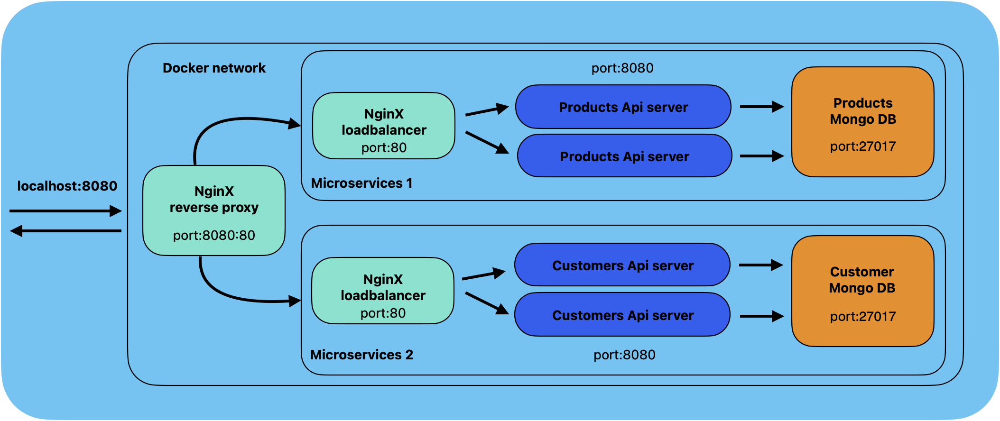

# HUNCUT GEMS WEBSHOP

## Overview
This webshop offers Hungarian-inspired accessories for tourists. 
Built with React for the frontend and Express.js for the backend, using mongoDb as database.

## Features
- **User Registration**: Users can register and place an order.
- **Order Management**: Full CRUD functionality for the order process.
- **Load Balancing**: Separate NGINX load balancers for customer and product APIs.
- **Dockerized Infrastructure**: Scalable setup using `docker-compose` with support for scaling API services.
- **Single Entry Point**: Main NGINX reverse proxy routes frontend and backend traffic.

## Tech Stack
- **Frontend**: React.js with Vite
- **Backend**: Express.js (two services: `product-cart-service` and `customer-service`)
- **Database**: MongoDB
- **Infrastructure**: Docker, Docker Compose, NGINX

## Prerequisites
- **Docker & Docker Compose**

## Topology


## Docker-Based Setup

This project uses Docker Compose with:
- Two backend services (product & customer), each scalable.
- Dedicated MongoDB instances per service.
- Two internal NGINX load balancers (one per backend service).
- One main NGINX reverse proxy for serving the frontend and routing API traffic.

## Installation
### Clone repository 
```bash
git clone https://github.com/kosaeszter/devops-docker-project
```

### Environment Variables
Configure your environment variables in a .env file (example .env.sample provided).

### Start dockerized services
```bash
cd services
chmod +x start.sh
./start.sh
```
This script runs:
- Builds and starts all services in the background.
- Scales both API services to 2 instances each.

Starts:
- MongoDB databases
- Two internal NGINX load balancers
- Product and customer API services
- Main NGINX reverse proxy

### Build frontend
In a separate terminal 
```bash
npm install
npm run build
```
### Access webshop
Access the webshop at: http://localhost:8080 in your browser

### Stop and cleanup
Run this command in the terminal used for dockerizing: 
```bash
chmod +x stop.sh
./stop.sh
```
This script runs:
- Stops and removes all containers and orphaned services

## License
This project is open source under the ISC license.

## Contact
For any inquiries or support, reach out:
- **GitHub**: [contact](https://github.com/schuschii)
